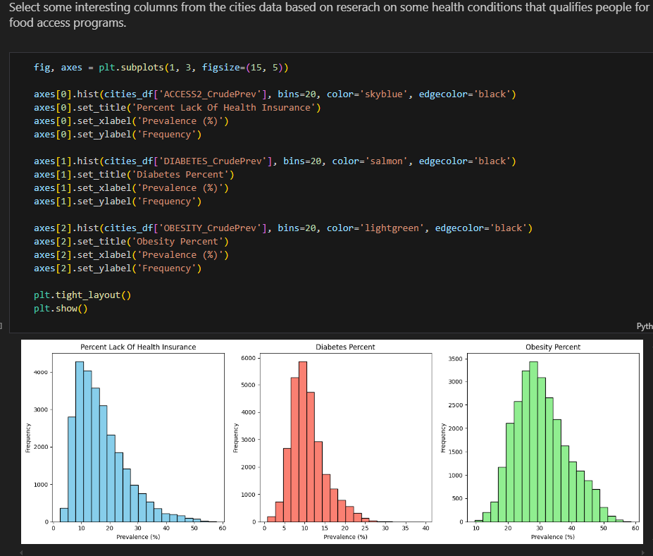

# Food Access Analysis for Medicare Advantage Plan

## Project Overview
This repository contains an analysis of food access challenges using CDC and FDA public datasets. The project explores potential strategies for a Medicare Advantage plan to address food insecurity among its members.

## Objectives
- Work with messy data from public data sources
- Identify optimal locations for deploying a food access program
- Estimate the number of people who could be included and can benefit
- Determine which subgroups might benefit most from the program
- Project the potential impact of the program

## Data Sources
- [CDC 500 Cities Project](https://chronicdata.cdc.gov/500-Cities/500-Cities-Census-Tract-level-Data-GIS-Friendly-Fo/k86t-wghb)
- [FDA Food Environment Atlas](https://www.ers.usda.gov/data-products/food-environment-atlas/data-access-and-documentation-downloads/)

## Descriptive Statistics

## Exploratory Data Analysis
### Histogram analysis for conditions

### Geoplots

## Multivariate Analysis

## Pair plot

## Target areas after scoring

